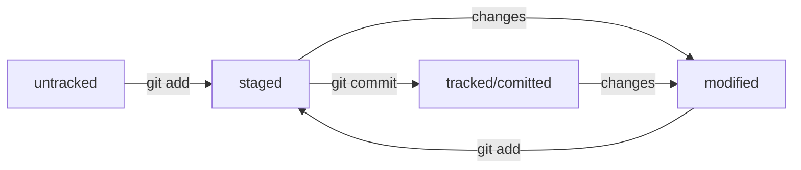

# Summary  

Git
---
Git — это система контроля версий, которая помогает отслеживать изменения в проекте. Этот инструмент можно использовать как для индивидуальной, так и для командной работы.  

#### Базовые команды в консоли
###### Навигация

pwd (от англ. print working directory, «показать рабочую папку») — покажи, в какой я папке;  
ls (от англ. list directory contents, «отобразить содержимое директории») — покажи файлы и папки в текущей папке;  
ls -a — покажи также скрытые файлы и папки, названия которых начинаются с символа .;  
cd first-project (от англ. change directory, «сменить директорию») — перейди в папку first-project;  
cd first-project/html — перейди в папку html, которая находится в папке first-project;  
cd .. — перейди на уровень выше, в родительскую папку;  
cd ~ — перейди в домашнюю директорию (/Users/Username);  
cd / — перейди в корневую директорию.  

##### Работа с файлами и папками  
###### Создание  

touch index.html (англ. touch, «коснуться») — создай файл index.html в текущей папке;  
touch index.html style.css script.js — если нужно создать сразу несколько файлов, можно напечатать их имена в одну строку через пробел;  
mkdir second-project (от англ. make directory, «создать директорию») — создай папку с именем second-project в текущей папке.  

###### Копирование и перемещение

cp file.txt ~/my-dir (от англ. copy, «копировать») — скопируй файл в другое место;  
mv file.txt ~/my-dir (от англ. move, «переместить») — перемести файл или папку в другое место.  

###### Чтение

cat file.txt (от англ. concatenate and print, «объединить и распечатать») — распечатай содержимое текстового файла file.txt.

###### Удаление

rm about.html (от англ. remove, «удалить») — удали файл about.html;  
rmdir images (от англ. remove directory, «удалить директорию») — удали папку images;  
rm -r second-project (от англ. remove, «удалить» + recursive, «рекурсивный») — удали папку second-project и всё, что она содержит.  

##### Полезные возможности
Команды необязательно печатать и выполнять по очереди. Можно указать их списком — разделить двумя амперсандами (&&).  

У консоли есть собственная память — буфер с несколькими последними командами. По ним можно перемещаться с помощью клавиш со стрелками вверх (↑) и вниз (↓).  

Чтобы не вводить название файла или папки полностью, можно набрать первые символы имени и дважды нажать Tab. Если файл или папка есть в текущей директории, командная строка допишет путь сама.  
Например, вы находитесь в папке dev. Начните вводить cd first и дважды нажмите Tab. Если папка first-project есть внутри dev, командная строка автоматически подставит её имя. Останется только нажать Enter.

##### Working with the repository  
Сделать папку репозиторием — *git init*  
> Помните, что не рекомендуется создавать репозиторий Git внутри другого Git-репозитория. Это может вызывать проблемы с отслеживанием изменений.

«Разгитить» папку, если что-то пошло не так, — *rm -rf .git*  
Проверить состояние репозитория — *git status*  
Подготовить файлы к сохранению  
*git add file*  
*git add .* #добавить всю текущую папку  
*git add --all*  # подготовили к сохранению все файлы в репозитории  

Выполнить коммит — *git commit -m "description"*  
Просмотреть историю коммитов — *git log*    

GitHub
---
1. Log in
2. Create a new repository
3. SSH-key 
4. Привязать удалённый репозиторий к локальному — *git remote add*. Команде необходимо передать два параметра: имя удалённого репозитория и его URL.  
Перейдите на страницу удалённого репозитория, выберите тип SSH и скопируйте URL.  
*cd ~/dev/first-project*  
*git remote add origin git@github.com:%ИМЯ_АККАУНТА%/first-project.git*   
Убедиться, что репозитории связаны, — *git remote -v*  
5. Синхронизируем локальный и удалённый репозитории  
Отправить изменения на удалённый репозиторий — *git push*

SSH
---
###### Проверка наличия SSH-ключа
Прежде чем генерировать SSH-ключи, убедитесь, что у вас их ещё нет.
*cd ~ # перешли в домашнюю директорию*  
*ls -la .ssh/ # вывели список созданных ключей*  

###### Инструкция по генерации SSH-ключа
*ssh-keygen -t ed25519 -C "электронная почта, к которой привязан ваш аккаунт на GitHub"*  
> Если вы видите сообщение об ошибке, то, скорее всего, ваша система не поддерживает алгоритм шифрования ed25519 - используйте другой алгоритм.  
*ssh-keygen -t rsa -b 4096 -C "электронная почта, к которой привязан ваш аккаунт на GitHub"*  

После ввода отобразится такое сообщение.
*Generating public/private rsa key pair. # сгенерированы публичный и приватный ключи*  
Укажите место хранения ключей. Простой вариант — сделать домашний каталог пользователя путём по умолчанию. Для этого нажмите Enter.
> Программа запросит кодовую фразу (англ. passphrase) для доступа к SSH-ключу. Вы можете оставить поле пустым. Для этого нажмите Enter, а затем ещё раз Enter для подтверждения.

Теперь осталось проверить, что ключи действительно сгенерировались. Для этого вызовите  
*ls -a ~/.ssh*  

На экране должны появиться два файла — один с расширением .pub, другой — без. Файл в .pub — публичный, им можно делиться с веб-сайтами или коллегами. Файл без расширения .pub — приватный. __Ни в коем случае не передавайте его никому!__  
###### Инструкция по связыванию SSH-ключа и GitHub-аккаунта
1. Скопируйте содержимое файла с публичным ключом в буфер обмена.  
*cat ~/.ssh/id_rsa.pub или cat ~/.ssh/id_ed25519.pub* и скопируйте вывод в буфер обмена из консоли.  
2. Перейдите на GitHub и выберите пункт Settings в меню аккаунта.
3. В меню слева нажмите на пункт SSH and GPG keys.
4. В открывшейся вкладке выберите New SSH key.
5. В поле Title напишите название ключа. Например, Personal key.
6. В поле Key type должно быть Authentication Key.
7. В поле Key скопируйте ваш ключ из буфера обмена.
8. Нажмите на кнопку Add SSH key.
Проверьте правильность ключа с помощью следующей команды.  
*ssh -T git@github.com*  

Work with commits
---
#### Хеш — идентификатор коммита  
__Хеширование__ (*от англ. hash, «рубить», «крошить», «мешанина»*) — это способ преобразовать набор данных и получить их «отпечаток».  
Git хеширует (преобразует) информацию о коммите с помощью алгоритма SHA-1 (от англ. Secure Hash Algorithm — «безопасный алгоритм хеширования») и получает для каждого коммита свой уникальный __хеш__ — результат хеширования.
Обычно хеш — это короткая (*4040 символов в случае SHA-1*) строка, которая состоит из цифр 0—90—9 и латинских букв A—FA—F (*заглавных или строчных*). Она обладает следующими свойствами:  
- если хеш получить дважды для одного и того же набора входных данных, то результат будет гарантированно одинаковый;
- если хоть что-то в исходных данных поменяется (хотя бы один символ), то хеш тоже изменится (причём сильно).  
Хеш — основной идентификатор коммита и позволяет узнать его автора, дату и содержимое закоммиченных файлов.  
Все хеши, а также таблицу соответствий *хеш → информация* о коммите Git хранит в папке .git.

Получить сокращённый лог — *git log --oneline*  
> В сокращённом логе выводятся сокращённые хеши — их можно использовать точно так же, как и полные.

#### Файл HEAD
 — один из служебных файлов папки .git. Он указывает на коммит, который сделан последним (то есть на самый новый).  
Внутри HEAD — ссылка на служебный файл: *refs/heads/master*. Если заглянуть в этот файл, можно увидеть хеш последнего коммита.  
Когда вы делаете коммит, Git обновляет *refs/heads/master* — записывает в него хеш последнего коммита. Получается, что HEAD тоже обновляется, так как ссылается на *refs/heads/master*.
> Мы уже упоминали, что многие команды Git принимают в качестве параметра хеш коммита. Если нужно передать последний коммит, то вместо его хеша можно просто написать слово HEAD — Git поймёт, что вы имели в виду последний коммит.  

### Статусы файлов в Git
- untracked (англ. «неотслеживаемый») Новые файлы в Git-репозитории помечаются как untracked. Git «видит», что такой файл существует, но не следит за изменениями в нём. У untracked-файла нет предыдущих версий, зафиксированных в коммитах или через команду git add.
- staged (англ. «подготовленный») После выполнения команды git add файл попадает в staging area (от англ. stage — «сцена» и area — «область»), то есть в список файлов, которые войдут в коммит. В этот момент файл находится в состоянии staged.
- tracked (англ. «отслеживаемый») Состояние tracked — это противоположность untracked. Оно довольно широкое по смыслу: в него попадают файлы, которые уже были зафиксированы с помощью git commit, а также файлы, которые были добавлены в staging area командой git add. То есть все файлы, в которых Git так или иначе отслеживает изменения.
- modified (англ. «изменённый») Состояние modified означает, что Git сравнил содержимое файла с последней сохранённой версией и нашёл отличия. Например, файл был закоммичен и после этого изменён.

##### Команда git status
* показывает явно следующие состояния файлов: untracked, staged и modified.
* подсказывает, какие команды можно выполнить, чтобы поменять состояние файла.

### Оформление сообщений к коммитам
Требования:
- сообщение коммита легко читается;
- оно информативное;
- все сообщения оформлены в одном стиле.

### Как исправить коммит
--amend рассчитан на работу с последним коммитом (HEAD)  
__Дополнить коммит новыми файлами или сделать дополнительные изменения в уже добавленном в коммит файле__  
— *git commit --amend --no-edit*  
Дополните последний коммит забытым файлом common.css с помощью опции *--amend*.

```bash
$ git add common.css
# добавили файл common.css в список на коммит как обычно

# но вместо команды commit -m '...'
# будет:
$ git commit --amend --no-edit

$ git log --oneline
8340eb2 Добавить главную страницу
# коммит в истории всё ещё один (но у него новый хеш) 
```

> С опцией --amend команда commit не создаст новый коммит, а дополнит последний, просто добавив в него файл *common.css*.  
Опция __--no-edit__ сообщает команде commit, что сообщение коммита нужно оставить как было.  

__Изменить сообщение коммита__ — *git commit --amend -m "Новое сообщение"*

### Как откатиться назад, если «всё сломалось»
__Выполнить unstage изменений__ — *git restore --staged <file>*
Допустим, вы создали или изменили какой-то файл и добавили его в список «на коммит» (staging area) с помощью git add, но потом передумали включать его туда. Убрать файл из staging поможет команда git restore --staged <file> (от англ. restore — «восстановить»).  
__«Откатить» коммит__ — *git reset --hard <commit hash>*
Иногда нужно «откатить» то, что уже было закоммичено, то есть вернуть состояние репозитория к более раннему. Для этого используют команду *git reset --hard <commit hash>* (от англ. reset  — «сброс», «обнуление» и hard — «суровый»). 

```bash 
$ git log --oneline # хеш можно найти в истории
7b972f5 (HEAD -> master) style: добавить комментарии, расставить отступы
b576d89 feat: добавить массив Expenses и цикл для добавления трат # вот сюда и вернёмся
4b58962 refactor: разделить analyzeExpenses() на countSum() и saveExpenses()

$ git reset --hard b576d89
HEAD is now at b576d89 feat: добавить массив Expenses и цикл для добавления трат 
```

__«Откатить» изменения, которые не попали ни в staging, ни в коммит,__ — *git restore <file>*  
Может быть так, что вы случайно изменили файл, который не планировали. Теперь он отображается в Changes not staged for commit (modified). Чтобы вернуть всё «как было», можно выполнить команду git restore <file>.  

### Просматриваем изменения в файлах
__Команда *git diff*__ сравнит последнюю закоммиченную версию файла с той, что находится в состоянии modified.  
__Команда *git diff --staged*__ покажет изменения в staged-файлах относительно последних закоммиченных версий.  

#### echo
Сама по себе эта команда просто выводит в консоль то, что ей передали в качестве параметра.  
Но если скомбинировать *echo* с символами перенаправления вывода __>>__, то всё будет записано в файл.  
Одинарный символ __>__ тоже перенаправит вывод команды в файл, но перед этим сотрёт содержимое файла, то есть перезапишет файл целиком. 
 
### Сравниваем коммиты
- команде *git diff <hash1> <hash2>* передаем два параметра - хеши сравниваемых коммитов.

### Игнорирование файлов в Git
Чтобы Git игнорировал какие-то файлы и не пытался добавить их в репозиторий, нужно создать файл *.gitignore* и записать в него названия игнорируемых файлов.
> Правила из .gitignore применяются только к новым (untracked) файлам. Если файл уже попал в staging area или в коммит, то правила на него не распространяются.

#### Комментарий
Если строка начинается с #, то это комментарий, и *.gitignore* не будет его учитывать.

#### Звёздочка (*)
Символ звёздочки (*) соответствует любой строке, включая пустую. Если такой символ используется в шаблоне в *.gitignore*, значит, файл будет проигнорирован вне зависимости от того, что будет на месте звёздочки.  

```bash
#игнорировать все файлы, которые заканчиваются на .jpeg  
*.jpeg  
#игнорировать все файлы "tmp" во всех подпапках папки docs  
docs/*/tmp  
```

#### Вопросительный знак (?)
Вопросительный знак ? соответствует одному любому символу.

file?.txt 

Если сохранить такую запись в *.gitignore*, то будут проигнорированы, например, файлы fileA.txt и file1.txt. А вот файл file12.txt не будет проигнорирован, потому что в его названии два символа после file, а не один.

#### Квадратные скобки ([…])
Квадратные скобки, как и вопросительный знак, соответствуют одному символу. При этом символ не любой, а только из списка, который указан в скобках.

```bash
# игнорировать файлы file0.txt, file1.txt и file2.txt
# при этом не игнорировать file3.txt, file4.txt, ...
file[0-2].txt 
```

В скобках можно либо перечислить символы ([abc]), либо задать диапазон ([a-z]).

#### Слеш (/)
Косая черта, или слеш (/), указывает на каталоги. Если шаблон в *.gitignore* начинается со слеша, то Git проигнорирует файлы или каталоги только в корневой директории.

```bash
# игнорировать todo.txt в корне репозитория
/todo.txt

# для сравнения: spam.txt будет игнорироваться во всех папках
spam.txt 
```

Теперь файл todo.txt в корневом каталоге будет проигнорирован. При этом, например, файл subdir/todo.txt по-прежнему отслеживается.
Если шаблон заканчивается слешем, то правило применится только к папке.

```bash
# игнорировать папку build
build/ 
```

> Обратите внимание: если build — это папка, то она будет проигнорирована. Если build — обычный файл, то он не подпадёт под правило и не будет игнорироваться.

#### Парные звёздочки (**)
Функция парных звёздочек (**) похожа на функцию одинарной (*). Отличие в том, как они работают с вложенными папками. Двойная звёздочка может соответствовать любому количеству таких папок (в том числе нулю). Одинарная может соответствовать только одной.

```bash
# игнорировать файлы "docs/current/tmp", "docs/old/tmp",
# а также "docs/old/saved/a/b/c/d/tmp"
# и даже "docs/tmp", потому что ноль вложенных папок тоже подходит
docs/**/tmp

# игнорировать только "docs/current/tmp" и "docs/old/tmp"
# файл "docs/old/saved/a/b/c/d/tmp" не попадает в правило
docs/*/tmp 
```

#### Восклицательный знак (!)
Любое правило в файле .gitignore можно инвертировать с помощью восклицательного знака (!).

```bash
# игнорировать все JPEG-файлы
*.jpeg

# но только не мем с Doge
!doge.jpeg 
```

Теперь файл doge.jpeg будет отслеживаться, хотя остальные jpeg-файлы будут проигнорированы. Такие правила удобны для добавления исключений из других правил *.gitignore*.

#### .gitignore и git status
Игнорируемые файлы не отображаются в выводе команды git status, иначе они бы засоряли вывод.
Если всё же нужно отобразить все игнорируемые файлы, то это можно сделать с помощью ключа *--ignored*: *git status --ignored*. В таком случае в выводе git status появится раздел Ignored files.

Работа с репозиториями
---
### Копирование репозиториев
Клонировать репозиторий — *git clone*   
- Команда *git clone* копирует проект на локальный компьютер.
- *git clone* автоматически связывает локальный репозиторий с удалённым.

### Выполняем Fork
__Fork (англ. «развилка», «ответвление»), или «форк»,__ — это GitHub-операция; напрямую с Git она не связана. «Форк» создаёт копию репозитория в аккаунте GitHub. Такая копия будет полностью независима. Изменения, которые вы внесёте, не будут синхронизированы с исходным репозиторием.  
В процессе «форка» создаётся копия всех файлов, истории коммитов и веток. Эта копия сохраняется в вашей учётной записи GitHub.
Вот некоторые из распространённых причин использования «форков»:  
- Вы хотите внести свой вклад в проект (например, open source), но не имеете прав на изменение исходного репозитория. Тогда вы можете сделать «форк», добавить нужные правки, а затем отправить запрос на включение этих изменений в оригинальный проект.
- Вы хотите развивать проект независимо от исходного. Допустим, создатели проекта решили, что не будут добавлять функциональность, которая вам необходима. В таком случае вы можете сделать «форк» и добавить её самостоятельно.

### Ветки: создание, навигация, сравнение
__Ветка (англ. branch)__ — это изолированный поток разработки проекта.  
Ветки позволяют экспериментировать с проектом в Git, но при этом сохранять репозиторий в стабильном состоянии. Каждый член команды может работать в своей ветке и не мешать другим: коммиты, которые он сделает, не будут видны из других веток. А когда работа будет доделана, ветки можно соединить.
Ветки полезны, даже если вы работаете в одиночку — например, над сайтом. Прежде чем писать новую функциональность, для неё следует создать отдельную ветку.
> Основная, стабильная версия проекта хранится в главной ветке __main__ или __master__. Она появляется автоматически при создании репозитория. Часто все новые ветки в репозитории отходят от main, хотя это не является правилом.

__Просмотреть ветки проекта__ — *git branch*  
__Создать ветку__ — *git branch <название_ветки>*  
> Название ветки в Git может состоять из букв, цифр, а также включать любой из четырёх символов: ., -, _, /. Эти символы не несут особого смысла. Например, ветка feature/add-branch-info могла бы называться feature_add-branch-info или feature-add-branch. Обратите внимание, что ветки не образуют иерархии, как директории, разделённые символом /.
__Переключиться на другую ветку__ — *git checkout <название_ветки>*  
__Создать ветку и сразу переключиться на неё__ — *git checkout -b <название_ветки>*  
__Сравнить ветки__ — *git diff <название_ветки1> <название_ветки2>*  

#### Суффикс навигации ~
Сравнивать хеши комитов может быть неудобно, ведь в одной ветке их может быть много.  
Для облегчения этой задачи в Git есть суффикс навигации \~N, где N — это число. Он отсчитывает от заданного коммита N коммитов назад во времени.   Нумерация начинается с нуля: commit\~0 — это сам коммит, commit\~1 — предыдущий, commit\~2 — предшествующий предыдущему и так далее.  

Например, HEAD\~1 — это следующий за текущим коммит. А main\~5 — это пятый коммит в ветке main, если считать с последнего выполненного коммита.
На практике чаще нужен либо текущий коммит (HEAD), либо следующий за ним (HEAD\~1). *Для \~1 есть специальное сокращение '~' (без числа). То есть вместо HEAD\~1 обычно пишут просто HEAD\~.*

__Выполнить слияние__ — *git merge <название_ветки>*  
__Удалить ветку после объединения__ — *git branch -D <название_ветки>*  
*git branch -d* удалит ветку только если она была полностью объединена с другой — то есть если две ветки стали (или изначально были) частью одной истории. Например, если вы нечаянно создали ветку с неправильным названием, её можно удалить через git branch -d %имя_ветки  

### Знакомьтесь: конфликт
Если Git не может провести слияние изменений автоматически, он сообщает о конфликте. __Конфликт__ — это ситуация, в которой один или несколько человек модифицировали один и тот же файл. При этом результаты таких модификаций оказались несовместимы и разобраться в том, какой из вариантов правильный, может только человек.  
В разработке, например, конфликты чаще всего возникают, когда несколько программистов одновременно меняют код в одном и том же месте.

Как разрешать конфликты: общие рекомендации  
Во время слияния Git сам подсвечивает файлы, которые не смог объединить. Чтобы разобраться в ситуации, нужно сделать следующее:
1. Заглянуть в файл, где произошёл конфликт.
2. Изучить обе стороны конфликта — вашу версию и версию вашего коллеги. Ваша задача — правильно собрать две версии в итоговую, так чтобы изменения обеих сторон не потерялись. Новая версия станет текущей актуальной.
3. Вручную удалить или подправить неактуальные изменения, если они есть.
4. Подготовить изменения к сохранению и сделать коммит.

__Отправить локальную ветку в удалённый репозиторий__ — *git push -u origin <удаленная>*

### Создаём pull request
Механизм __pull request__ (англ. «запрос на изменения»; буквально: «запрос на подтягивание»). В обиходе его обычно так и называют — «пул-реквест», или ещё короче — ПР или PR. Пул-реквест — это запрос на рассмотрение предлагаемых изменений и часть процесса ревью.  
Алгоритм такой:  
1. Вы трудитесь над задачей в своей ветке — например, пишете код новой функциональности.
2. Вы заканчиваете работу, а затем создаёте пул-реквест.
3. Ваши коллеги проверяют, что код выглядит аккуратно и лаконично, а программа работает корректно; также оставляют комментарии. Этот процесс называют code review (англ. «рассмотрение кода»), или просто ревью.
4. После финального согласования вы заливаете свою ветку в основную.

#### Из чего состоит pull request и чем он может обернуться
У каждого пул-реквеста есть:
- Название — краткое описание предлагаемых изменений. Например: Адаптивный заголовок сайта, Замена альбома на галерею и так далее.
- Описание — развёрнутое описание изменений. Это поле заполнять необязательно, но желательно.
- Исходная ветка — та, в которой вы работали. Например, feature/merge-request.
- Целевая ветка — основная ветка проекта, в которую вы хотите внести изменения.

Также у каждого пул-реквеста может быть два исхода:

* merge (англ. «соединить») — предлагаемые изменения приняты; код вливается в целевую ветку; пул-реквест закрывается.
* close (англ. «закрыть») — пул-реквест закрывается без слияния изменений.

Запрос на изменения можно инициировать двумя способами: через ссылку, которую Git выводит после создания ветки, или через интерфейс GitHub.
> Чтобы создать пул-реквест для любой существующей ветки на GitHub, перейдите на страницу репозитория, а затем выберите вкладку Pull requests в верхней части экрана. Нажмите на зелёную кнопку New pull request.  
Выберите названия веток: ветка «откуда» (из которой будет происходить пул-реквест) и ветка «куда» (в которую он будет осуществлён). В нашем случае изменения должны попасть из ветки feature/merge-request в ветку main. На направление изменений указывает стрелка.   
В окне ниже отобразится несколько коммитов, а также их изменения. Нажмите на кнопку Create pull request.  
После создания пул-реквеста ваши коллеги сделают ревью — оценят предложенные вами правки и оставят свои комментарии.

### Забираем изменения из удалённого репозитория
__Забрать изменения из удалённого репозитория__ — *git pull* (от англ. pull — «вытянуть») — стянуть, или «запулить» изменения.  
Алгоритм такой. Сначала нужно перейти в локальный репозиторий и убедиться, что вы находитесь в правильной ветке, — как правило, это основная ветка main (или master). Затем можно ввести команду.

```bash
$ git pull 
```

> Обычно git pull — это первая команда, которую вводит разработчик, как только открывает код проекта, чтобы начать с ним работать.  

Дополнительно git pull и git merge выполняют перед тем, как создать пул-реквест. При командной работе, особенно в больших командах, основная ветка часто успевает «убежать» вперёд, пока вы подготавливаете свои изменения. Поэтому перед созданием пул-реквеста рекомендуется сначала подтянуть изменения из основной ветки, объединить их с вашей, решить все возможные конфликты и лишь затем сделать push.

```bash
$ git checkout main # перешли в main
$ git pull # подтянули новые изменения в main
$ git checkout my-branch # вернулись в рабочую ветку my-branch
$ git merge main # влили main в новую ветку my-branch
$ git push -u origin my-branch # отправили ветку my-branch в удалённый репозиторий
```

Работа с ветками на практике
---
### Состояние fast-forward
Две ветки находятся в состоянии fast-forward, если одну из них можно «перемотать» вперёд и она будет содержать те же коммиты, что и другая. Это утверждение можно сформулировать иначе:
- при слиянии этих двух веток никак не возможен конфликт;
- истории этих двух веток не «разошлись»;
- одна ветка является продолжением другой.

#### Можно ли отключить fast-forward
Fast-forward слияние веток можно отключить флагом --no-ff. Например: git merge --no-ff add-docs. Также его можно отключить «навсегда» (до тех пор, пока вы не вернёте настройку «как было») с помощью настройки merge.ff: git config [--global] merge.ff false.  
Если отключить слияние в режиме fast-forward, вместо «перемотки» ветки Git создаст в ней коммит слияния (англ. merge commit) — в обиходе его называют merge-коммит или мёрж-коммит. В этом случае результат «вливания» ветки add-docs в main выглядел бы так.
```bash
# находимся в ветке main
# --no-edit отключает ввод сообщения для merge-коммита
# --no-ff отключает fast-forward слияние веток

$ git merge --no-edit --no-ff add-docs
Merge made by the 'ort' strategy.
 docs.txt | 1 +
 1 file changed, 1 insertion(+)
 create mode 100644 docs.txt

# с флагом --graph
# Git нарисует ветки с помощью «палочек» и «звёздочек»
# получившийся коммит слияния: 6814789

$ git log --graph --oneline
*   6814789 (HEAD -> main) Merge branch 'add-docs'
|\
| * e08fa2a (add-docs) New docs 2
| * fd588b2 New docs 1
|/
* 997d9ce Commit 4
* 0313e8e Commit 3
* 5848aba Commit 2
* 04923d7 Commit 1 
```

> *Зачем отключать fast-forward?* Многие проекты отключают fast-forward слияние веток, потому что при нём теряется часть информации. Результат выглядит так, как будто в main «просто появились» новые коммиты. Если не знать о ветке add-docs, то можно подумать, что такой ветки и не было. Полноценный коммит слияния сохраняет всю информацию: в нём будет указано, какая именно ветка вливалась в main.

### Состояние non-fast-forward
Вернёмся к примеру с ветками main и add-docs и представим такую ситуацию: истории двух веток «разошлись». Это значит, что их коммиты уже нельзя выстроить в одну линию.  
Например, после «отделения» add-docs в ветку main добавили новый коммит Commit 5.
--*--*--*--*---*-- main
 1   2  3  4\   5
             *--*-- add-docs
            (1) (2)
```bash
# команде git log можно указать несколько веток,
# и тогда она выведет их все

$ git log --graph --oneline main add-docs
* 15d3f04 (HEAD -> main) Commit 5
| * 8de42eb (add-docs) New docs 2
| * 4d3c346 New docs 1
|/
* 73def1e Commit 4
* 9c30ab3 Commit 3
* 83cc5ec Commit 2
* 8e87fb2 Commit 1 
```
Теперь просто «положить» все коммиты из add-docs в main не получится. Например, коммит C5 из main может конфликтовать с каким-нибудь коммитом из ветки add-docs (N1​ или с N2​). То есть содержать изменения в тех же файлах (и в тех же строках), что и коммит C5.  
> Когда Git проверяет ветки на состояние fast-forward, он не «заглядывает» в файлы и не пытается угадать, будет ли конфликт на самом деле. Для Git важно только, что конфликт теоретически возможен (или, наоборот, никак не возможен).
При слиянии не-fast-forward веток Git создаёт коммит слияния.
```bash
# находимся в ветке main
# --no-edit избавляет от необходимости
# вводить сообщение для merge-коммита
$ git merge --no-edit add-docs
Merge made by the 'ort' strategy.
 docs.txt | 1 +
 1 file changed, 1 insertion(+)
 create mode 100644 docs.txt

# коммит слияния: 34f5f8f
$ git log --graph --oneline
*   34f5f8f (HEAD -> main) Merge branch 'add-docs'
|\
| * 8de42eb (add-docs) New docs 2
| * 4d3c346 New docs 1
* | 15d3f04 Commit 5
|/
* 73def1e Commit 4
* 9c30ab3 Commit 3
* 83cc5ec Commit 2
* 8e87fb2 Commit 1 
```
Если конфликтов при слиянии нет, команда git merge отработает почти автоматически — только предложит вам ввести сообщение для нового коммита слияния.
> Чаще всего сообщения к коммитам слияния не редактируют и оставляют «как предложил Git». Для таких случаев удобен флаг --no-edit: git merge --no-edit %another_branch%.
Если конфликты всё-таки есть, Git сначала попытается разрешить их автоматически. Если не получится, Git предложит вам разрешить их вручную. 

### git push и fast-forward
#### Напомним про git push
Коротко напомним, что делает команда git push: она «толкает» коммиты из локальной ветки в её удалённую копию.  
Допустим, вы находитесь в ветке main в локальном репозитории и выполняете git push. В результате все новые коммиты из локальной ветки main попадут в ветку main в репозитории на GitHub. После этого локальная и удалённая ветки будут содержать одни и те же коммиты.  
Хотя git push не выполняет слияния веток, для этой команды тоже важно состояние fast-forward, но специфическое: между локальной веткой (откуда берутся коммиты для push) и удалённой (куда эти коммиты попадут).
> Обычно локальная и удалённая ветки называются одинаково. Чтобы их различать, мы будем называть локальные ветки просто именем (например, main), а удалённые — с суффиксом @origin (например, main@origin).
Ветка main находится на локальном компьютере, а main@origin — в репозитории на GitHub.

### git push и не-fast-forward
Представим, что ветки main и main@origin находятся в таком состоянии: в ветке main@origin есть коммиты C1, C2​ и D, а в main — C1​, C2, C3​, C4​.
Ветки main и main@origin «разошлись», то есть находятся в состоянии не-fast-forward. Если теперь попытаться выполнить команду git push, она выведет следующую ошибку.
```bash
# текущая ветка — main
$ git push
To github.com:username/repository.git
 ! [rejected]        main -> main (non-fast-forward)
error: failed to push some refs to 'github.com:username/repository.git'
hint: Updates were rejected because the tip of your current branch is behind
hint: its remote counterpart. Integrate the remote changes (e.g.
hint: 'git pull ...') before pushing again.
hint: See the 'Note about fast-forwards' in 'git push --help' for details. 
```
> Обратите внимание на надписи rejected (англ. «запрос отклонён») и non-fast-forward — Git подсказывает, что именно пошло не так.
#### Пара слов о rebase
В Git можно решить проблему «разошедшихся» веток с помощью операции rebase (англ. «перебазирование»). Эта операция позволяет изменить точку (коммит), от которой отделилась ветка. Результат перебазирования ветки main c коммита C2C2​ на коммит DD можно увидеть на схеме.
[схема](https://pictures.s3.yandex.net/resources/M4_T2_04202_1689675621.png)

После такого перебазирования ветки будут в состоянии fast-forward, и git push сработает без ошибок. Однако у такого шага могут быть последствия.   Например:
* могут возникать конфликты между изменениями, как при слиянии веток;
* если действовать неаккуратно, можно «сломать» репозиторий.

#### Пара слов о git push --force
Есть и другой способ справиться с ошибкой rejected: non-fast-forward — это форсированный пуш. Чтобы его выполнить, используют флаг --force (англ. «сила», «заставить»).  
Вернёмся к примеру с «разошедшимися» ветками main и main@origin.  
В этом случае команда git push --force просто «выкинет» (удалит) коммит D и запишет в main@origin коммиты из main.
[как будет выглядить main@origin](https://pictures.s3.yandex.net/resources/M4_T2_00_1689593419.png)
> В очень редких случаях это уместная команда. Например, если кто-то нечаянно «сломал» ветку main@origin, можно найти копию репозитория, в которой ветка main не «сломана», и использовать git push --force для восстановления ветки в origin.

### Почему бы не «пушить» всё в main
#### Связь git push, fast-forward и «все „пушат” в main»
В прошлом уроке мы рассказали вот о чём: команда git push ожидает, что локальная ветка и её удалённая версия не «разошлись», то есть одна может просто «догнать» другую без конфликтов.  
Если несколько человек будут «пушить» коммиты прямо в main, локальная ветка main и ветка main на GitHub будут постоянно «расходиться» у других участников команды.
> Форсированный пуш удалит работу Паши — следовательно, такой способ не подходит. Скорее всего, Лёша выберет операцию rebase и только после этого «запушит» свои изменения. Операция rebase может спасти проект из двух разработчиков, которые нечасто «коммитят» изменения. Но она не подойдёт, например, для команды из 1010 человек: им придётся тратить больше времени на перебазирование веток, а не на полезные задачи.

*__В большинстве систем управления репозиториями (GitHub, GitLab, Bitbucket и подобных) есть специальная настройка «запретить push в main». Чаще всего она включена, и прямые git push в main запрещены.__*

### Модели веток. Простая feature branch модель
