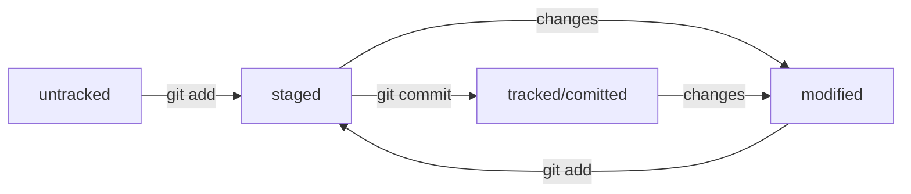

# Summary  

Git
---
Git — это система контроля версий, которая помогает отслеживать изменения в проекте. Этот инструмент можно использовать как для индивидуальной, так и для командной работы.  

#### Базовые команды в консоли
###### Навигация

pwd (от англ. print working directory, «показать рабочую папку») — покажи, в какой я папке;
ls (от англ. list directory contents, «отобразить содержимое директории») — покажи файлы и папки в текущей папке;
ls -a — покажи также скрытые файлы и папки, названия которых начинаются с символа .;
cd first-project (от англ. change directory, «сменить директорию») — перейди в папку first-project;
cd first-project/html — перейди в папку html, которая находится в папке first-project;
cd .. — перейди на уровень выше, в родительскую папку;
cd ~ — перейди в домашнюю директорию (/Users/Username);
cd / — перейди в корневую директорию.

##### Работа с файлами и папками  
###### Создание  

touch index.html (англ. touch, «коснуться») — создай файл index.html в текущей папке;  
touch index.html style.css script.js — если нужно создать сразу несколько файлов, можно напечатать их имена в одну строку через пробел;  
mkdir second-project (от англ. make directory, «создать директорию») — создай папку с именем second-project в текущей папке.  

###### Копирование и перемещение

cp file.txt ~/my-dir (от англ. copy, «копировать») — скопируй файл в другое место;
mv file.txt ~/my-dir (от англ. move, «переместить») — перемести файл или папку в другое место.

###### Чтение

cat file.txt (от англ. concatenate and print, «объединить и распечатать») — распечатай содержимое текстового файла file.txt.

###### Удаление

rm about.html (от англ. remove, «удалить») — удали файл about.html;
rmdir images (от англ. remove directory, «удалить директорию») — удали папку images;
rm -r second-project (от англ. remove, «удалить» + recursive, «рекурсивный») — удали папку second-project и всё, что она содержит.

##### Полезные возможности
Команды необязательно печатать и выполнять по очереди. Можно указать их списком — разделить двумя амперсандами (&&).

У консоли есть собственная память — буфер с несколькими последними командами. По ним можно перемещаться с помощью клавиш со стрелками вверх (↑) и вниз (↓).

Чтобы не вводить название файла или папки полностью, можно набрать первые символы имени и дважды нажать Tab. Если файл или папка есть в текущей директории, командная строка допишет путь сама.
Например, вы находитесь в папке dev. Начните вводить cd first и дважды нажмите Tab. Если папка first-project есть внутри dev, командная строка автоматически подставит её имя. Останется только нажать Enter.

##### Working with the repository  
Сделать папку репозиторием — *git init*  
> Помните, что не рекомендуется создавать репозиторий Git внутри другого Git-репозитория. Это может вызывать проблемы с отслеживанием изменений.

«Разгитить» папку, если что-то пошло не так, — *rm -rf .git*  
Проверить состояние репозитория — *git status*  
Подготовить файлы к сохранению  
*git add file*  
*git add .* #добавить всю текущую папку  
*git add --all*  # подготовили к сохранению все файлы в репозитории  

Выполнить коммит — *git commit -m "description"*  
Просмотреть историю коммитов — *git log*    

GitHub
---
1. Log in
2. Create a new repository
3. SSH-key 
4. Привязать удалённый репозиторий к локальному — *git remote add*. Команде необходимо передать два параметра: имя удалённого репозитория и его URL.  
Перейдите на страницу удалённого репозитория, выберите тип SSH и скопируйте URL.  
*cd ~/dev/first-project*  
*git remote add origin git@github.com:%ИМЯ_АККАУНТА%/first-project.git*   
Убедиться, что репозитории связаны, — *git remote -v*  
5. Синхронизируем локальный и удалённый репозитории  
Отправить изменения на удалённый репозиторий — *git push*

SSH
---
###### Проверка наличия SSH-ключа
Прежде чем генерировать SSH-ключи, убедитесь, что у вас их ещё нет.
*cd ~ # перешли в домашнюю директорию*  
*ls -la .ssh/ # вывели список созданных ключей*  

###### Инструкция по генерации SSH-ключа
*ssh-keygen -t ed25519 -C "электронная почта, к которой привязан ваш аккаунт на GitHub"*  
> Если вы видите сообщение об ошибке, то, скорее всего, ваша система не поддерживает алгоритм шифрования ed25519 - используйте другой алгоритм.  
*ssh-keygen -t rsa -b 4096 -C "электронная почта, к которой привязан ваш аккаунт на GitHub"*  

После ввода отобразится такое сообщение.
*Generating public/private rsa key pair. # сгенерированы публичный и приватный ключи*  
Укажите место хранения ключей. Простой вариант — сделать домашний каталог пользователя путём по умолчанию. Для этого нажмите Enter.
> Программа запросит кодовую фразу (англ. passphrase) для доступа к SSH-ключу. Вы можете оставить поле пустым. Для этого нажмите Enter, а затем ещё раз Enter для подтверждения.

Теперь осталось проверить, что ключи действительно сгенерировались. Для этого вызовите  
*ls -a ~/.ssh*  

На экране должны появиться два файла — один с расширением .pub, другой — без. Файл в .pub — публичный, им можно делиться с веб-сайтами или коллегами. Файл без расширения .pub — приватный. __Ни в коем случае не передавайте его никому!__  
###### Инструкция по связыванию SSH-ключа и GitHub-аккаунта
1. Скопируйте содержимое файла с публичным ключом в буфер обмена.  
*cat ~/.ssh/id_rsa.pub или cat ~/.ssh/id_ed25519.pub* и скопируйте вывод в буфер обмена из консоли.  
2. Перейдите на GitHub и выберите пункт Settings в меню аккаунта.
3. В меню слева нажмите на пункт SSH and GPG keys.
4. В открывшейся вкладке выберите New SSH key.
5. В поле Title напишите название ключа. Например, Personal key.
6. В поле Key type должно быть Authentication Key.
7. В поле Key скопируйте ваш ключ из буфера обмена.
8. Нажмите на кнопку Add SSH key.
Проверьте правильность ключа с помощью следующей команды.  
*ssh -T git@github.com*  

Хеш — идентификатор коммита
---
__Хеширование__ (*от англ. hash, «рубить», «крошить», «мешанина»*) — это способ преобразовать набор данных и получить их «отпечаток».  
Git хеширует (преобразует) информацию о коммите с помощью алгоритма SHA-1 (от англ. Secure Hash Algorithm — «безопасный алгоритм хеширования») и получает для каждого коммита свой уникальный __хеш__ — результат хеширования.
Обычно хеш — это короткая (*4040 символов в случае SHA-1*) строка, которая состоит из цифр 0—90—9 и латинских букв A—FA—F (*заглавных или строчных*). Она обладает следующими свойствами:  
- если хеш получить дважды для одного и того же набора входных данных, то результат будет гарантированно одинаковый;
- если хоть что-то в исходных данных поменяется (хотя бы один символ), то хеш тоже изменится (причём сильно).  
Хеш — основной идентификатор коммита и позволяет узнать его автора, дату и содержимое закоммиченных файлов.  
Все хеши, а также таблицу соответствий *хеш → информация* о коммите Git хранит в папке .git.

Получить сокращённый лог — *git log --oneline*  
> В сокращённом логе выводятся сокращённые хеши — их можно использовать точно так же, как и полные.

#### Файл HEAD
 — один из служебных файлов папки .git. Он указывает на коммит, который сделан последним (то есть на самый новый).  
Внутри HEAD — ссылка на служебный файл: *refs/heads/master*. Если заглянуть в этот файл, можно увидеть хеш последнего коммита.  
Когда вы делаете коммит, Git обновляет *refs/heads/master* — записывает в него хеш последнего коммита. Получается, что HEAD тоже обновляется, так как ссылается на *refs/heads/master*.
> Мы уже упоминали, что многие команды Git принимают в качестве параметра хеш коммита. Если нужно передать последний коммит, то вместо его хеша можно просто написать слово HEAD — Git поймёт, что вы имели в виду последний коммит.  

Статусы файлов в Git
---
- untracked (англ. «неотслеживаемый») Новые файлы в Git-репозитории помечаются как untracked. Git «видит», что такой файл существует, но не следит за изменениями в нём. У untracked-файла нет предыдущих версий, зафиксированных в коммитах или через команду git add.
- staged (англ. «подготовленный») После выполнения команды git add файл попадает в staging area (от англ. stage — «сцена» и area — «область»), то есть в список файлов, которые войдут в коммит. В этот момент файл находится в состоянии staged.
- tracked (англ. «отслеживаемый») Состояние tracked — это противоположность untracked. Оно довольно широкое по смыслу: в него попадают файлы, которые уже были зафиксированы с помощью git commit, а также файлы, которые были добавлены в staging area командой git add. То есть все файлы, в которых Git так или иначе отслеживает изменения.
- modified (англ. «изменённый») Состояние modified означает, что Git сравнил содержимое файла с последней сохранённой версией и нашёл отличия. Например, файл был закоммичен и после этого изменён.

#### Команда git status
* показывает явно следующие состояния файлов: untracked, staged и modified.
* подсказывает, какие команды можно выполнить, чтобы поменять состояние файла.

### Оформление сообщений к коммитам
Требования:
- сообщение коммита легко читается;
- оно информативное;
- все сообщения оформлены в одном стиле.
